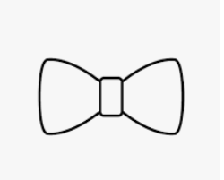

Here are the following requirements to completing Menu shapes:
1. Create menu that have 4 options
   1. Filled Triangle
   2. Filled Inverted Triangle
   3. This can be any shape such as square, circle, a different angle of the triange...etc
   4. (This option is extra credit create a Bow Tie shape an image of it is at the bottom)
   4. Exit (This Exit will be 5 if you wanting to do the extra credit)

I will need the following requirements:
1. Create a class to house all of the functions and a constructor.
2. You will need to ask the user to enter the height (the amount of rows) of your shape or you can ask them to enter the width and height of your shape.
3. while loop or do/while loop
4. for loop for each shape
5. functions for each shape

key point to help -> case statements for each menu option 1,2,3,4 (that can go inside of int main if you decide to go this route.)

